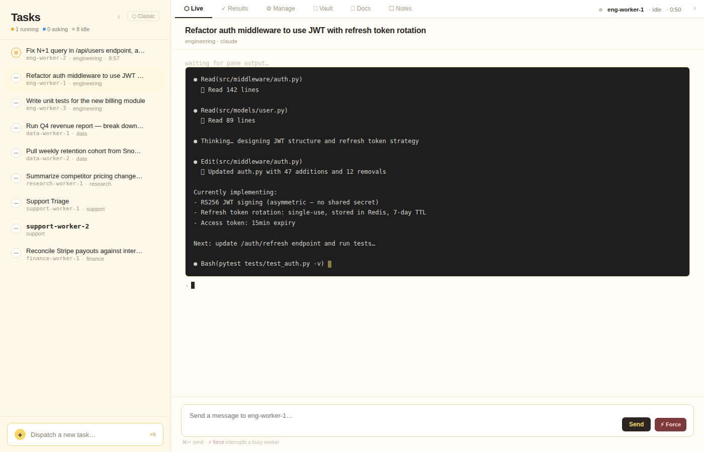
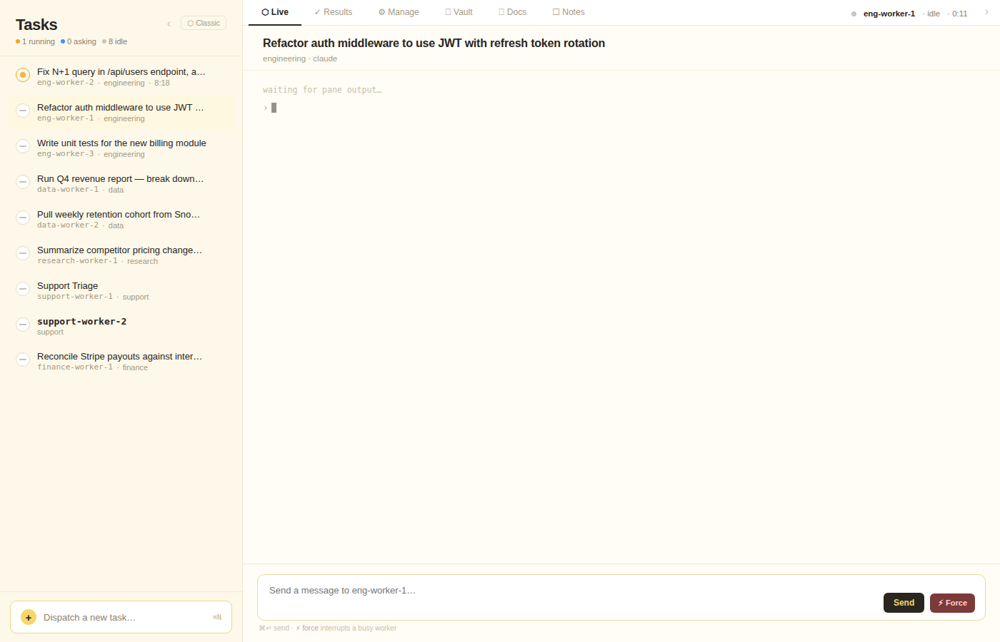
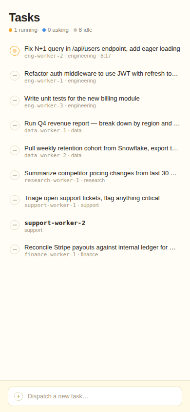

# orchmux

**A fleet manager for AI workers.** Run a dozen Claude Code sessions in parallel on your own server, dispatch tasks from a web dashboard or Telegram, watch them work live, and get completions pushed to your phone — no cloud infra, no framework boilerplate, no per-invocation cost.

---

## The problem

Claude Code is powerful in a single session. The problem is you can only really run one thing at a time. You open a new tmux window for each task, lose track of what's running where, have to be at your terminal to dispatch anything, and get no notification when work finishes.

The natural instinct is to open 5–10 windows and manually babysit them. orchmux makes that automatic.

---

## What it actually feels like

You open your laptop in the morning. Five tasks are already done — the data pull finished at 2am, the PR review ran overnight, the competitive research summary is sitting in your Vault. You read the results over coffee.

Before your first meeting, you dispatch three more tasks from your phone: a code refactor, a financial report, a research brief. You go into your meeting. By the time you're out, one is done and waiting, one is mid-run (you can see it streaming live on your phone), and one is paused — it hit a question it needs you to answer.

You tap "Yes, include NULLs" on the dashboard. The worker resumes and finishes in two minutes.

That's orchmux.

---

## Screenshots

### Workers + Live output — task list on the left, streaming terminal on the right



### Worker list — all sessions, domains, auth status, last task



### Mobile — full access from your phone browser over Tailscale



---

## Who is this for?

- You already run Claude Code or Codex in the terminal
- Your tasks take minutes or hours — long enough that you want to do something else while they run
- You want to dispatch from your phone and get notified when work is done
- You don't want to write Python agent frameworks just to run a few AI sessions in parallel
- You want workers that survive restarts — and resume exactly where they left off

---

## Core concepts

**Workers** are named tmux sessions running Claude Code (or any AI CLI). They're persistent — they have their own context, their own domain, their own task history.

**Domains** are logical groupings (engineering, data, research, finance, etc.). When you dispatch a task, orchmux routes it to an idle worker in the right domain based on keyword matching — or queues it if all workers are busy.

**Asking** — when a worker hits a decision it can't make alone (e.g. "Should I include NULL rows?"), it surfaces the question to the dashboard and Telegram instead of guessing. You answer, it resumes.

**Session resume** — if a worker crashes or the server restarts, orchmux saves the Claude Code session ID before exiting, and resumes it with `claude --resume <id>`. The worker picks up mid-conversation with full context intact.

**Vault** — workers can push markdown documents (summaries, runbooks, analysis) to a browsable file store. You browse and edit from the dashboard.

---

## How it compares

### vs. raw tmux + Claude Code

| Feature | tmux alone | orchmux |
|---|---|---|
| Dispatch tasks remotely | ❌ must be at terminal | ✅ Telegram, web UI, API |
| Know when a task is done | ❌ watch the screen | ✅ push notification + log |
| Queue tasks for busy workers | ❌ manual | ✅ automatic |
| Route by domain | ❌ manual | ✅ keyword auto-routing |
| See all workers at once | ❌ switch windows | ✅ live dashboard |
| Restart dead workers | ❌ manual | ✅ auto-heal watchdog |
| Resume sessions after restart | ❌ fresh context | ✅ graceful exit + `claude --resume` |

### vs. cloud agent platforms (Bedrock Agents, Vertex AI Agents)

| | Cloud agents | orchmux |
|---|---|---|
| Setup time | Days (IAM, VPC, Lambda) | ~30 minutes |
| Cost | Per-invocation + infra | Just your server |
| Debugging | CloudWatch, distributed traces | `tmux a -t worker-name` |
| Model lock-in | Platform SDKs | Any CLI |
| Long-running tasks | Timeout limits | No limit |
| Offline / air-gapped | ❌ | ✅ via Tailscale |

### vs. LangChain / CrewAI / AutoGen

| | LangChain / CrewAI | orchmux |
|---|---|---|
| Define agents | Python classes + decorators | A session name in YAML |
| Add a new worker | Write agent code | `tmux new-session -s worker-name` |
| Debug a stuck agent | Python debugger | `tmux a -t worker-name` |
| Model agnostic | Partial (framework adapters) | ✅ any CLI tool |
| Long-horizon tasks | Tricky (context, state) | ✅ native (Claude manages its own context) |
| Human-in-the-loop | Complex wiring | ✅ built-in |

---

## How it works

```
You (Telegram / Web Dashboard / API)
           │
           ▼
  ┌─────────────────────┐
  │   orchmux-server    │  ← Web dashboard (:9889) + REST API
  │   orchmux-telegram  │  ← Telegram bot
  └────────┬────────────┘
           │  routes task to idle worker (or queues)
           ▼
  ┌──────────────────────────────────────────────┐
  │  worker-1 (tmux)  │  worker-2  │  worker-N  │
  │  Claude Code      │  Claude    │  Codex     │
  └────────┬──────────┴────────────┴────────────┘
           │  [DONE] detected
           ▼
  ┌─────────────────────┐
  │   orchmux-watcher   │  ← polls panes every 5s
  └────────┬────────────┘
           │  POST /complete
           ▼
  Telegram notification + dashboard update
```

---

## Features

### Live dashboard (⬡ Live tab)
Stream every worker's terminal output in real time. See what Claude is reading, editing, running. Send a message or interrupt a busy worker with the Force button.

### Results (✓ Results tab)
Structured completion summaries: what changed, files modified with +/- line counts, test run output, copy/save actions.

### Vault (📂 Vault tab)
Browse and edit markdown documents your workers produce. Split raw-editor + live preview, Export to Doc. Organized by domain folder (Architecture, Runbooks, Logs, etc.).

### Docs (🗂 Docs tab)
Auto-generated documentation from worker outputs. Workers can push structured docs directly; humans can search and browse.

### Notes (☐ Notes tab)
Free-form scratchpad tied to the current worker session — annotate, flag issues, leave follow-up thoughts.

### Session resume
When a worker is restarted (crash, redeploy, server reboot), orchmux gracefully exits the Claude Code session (`/exit`), saves the session ID to disk, and resumes it with `claude --resume <id>` on relaunch. Workers keep their full conversation context across restarts.

### Smart context injection
Define credential and config snippets in `server/service-context.yaml`. When a task mentions a keyword (e.g. `metabase`, `snowflake`, `slack`), the matching snippet is automatically prepended — the worker has the right credentials without you repeating them.

```yaml
# server/service-context.yaml  (gitignored — never committed)
metabase: |
  ## Metabase Access
  - URL: http://metabase.internal:3000
  - API key: mb_YOUR_KEY
  - DB ID 1 = production

snowflake: |
  ## Snowflake Access
  - Account: your-account.snowflakecomputing.com
  - User: YOUR_USER  Password: YOUR_PASSWORD
```

### Auto-heal watchdog
Every orchmux component self-heals via `while true` shell loops. The watcher also monitors itself via cron (external safety net).

### Telegram integration
Dispatch tasks, check worker status, peek at terminal panes — all from Telegram. Completions are pushed as notifications. Free-text messages auto-route to the right domain worker.

---

## Access from your phone (Tailscale)

orchmux's web dashboard is a mobile-responsive single-page app. The cleanest way to access it securely from anywhere — including fully air-gapped setups — is Tailscale.

Tailscale is a zero-config WireGuard VPN. Your phone and server join the same private network; the dashboard is reachable only to devices on your tailnet. No port-forwarding, no public IP, no cloud intermediary.

### Setup (5 minutes)

**1. Install Tailscale on the server**
```bash
curl -fsSL https://tailscale.com/install.sh | sh
sudo tailscale up
# Note your Tailscale IP: tailscale ip -4   →  100.x.x.x
```

**2. Install Tailscale on your phone**
iOS or Android — install from the App Store / Play Store, sign in to the same account.

**3. Bind orchmux to the Tailscale IP**

In `.env.local`:
```
ORCHMUX_BIND_HOST=100.x.x.x
```

**4. (Optional) Generate a TLS cert for HTTPS**
```bash
openssl req -x509 -newkey rsa:2048 -days 3650 -nodes \
  -subj "/CN=orchmux" \
  -addext "subjectAltName=IP:100.x.x.x" \
  -keyout server/key.pem -out server/cert.pem
```
Accept the cert warning once in your phone browser — trusted from then on.

**5. Open the dashboard on your phone**
```
https://100.x.x.x:9889/dashboard
```

### Why this is effectively air-gapped

- Dashboard only reachable inside your Tailscale network
- WireGuard end-to-end encryption
- Works on cellular, public wifi — anywhere your phone has internet
- Workers themselves can be fully offline (no internet needed)
- Tailscale ACLs let you restrict which devices can reach which ports

### Headscale (self-hosted Tailscale)
For fully self-hosted/no-Tailscale-cloud setups, use [Headscale](https://github.com/juanfont/headscale) — a self-hosted Tailscale control plane. orchmux works identically; just point Tailscale clients at your Headscale server.

---

## Getting started (first time)

### Step 1 — Install dependencies

```bash
# tmux (if not already installed)
sudo apt install tmux        # Debian/Ubuntu
brew install tmux            # macOS

# Claude Code CLI
npm install -g @anthropic-ai/claude-code

# Python
python3 -m venv .venv && source .venv/bin/activate
pip install fastapi uvicorn pyyaml
```

### Step 2 — Clone and configure

```bash
git clone https://github.com/adhitShet/orchmux.git
cd orchmux

# Environment (Telegram + bind address)
cp .env.example .env.local
# Edit .env.local if you want Telegram or a specific bind IP

# Worker domains — defines what sessions orchmux manages
cp workers.yaml.example workers.yaml
```

### Step 3 — Create your first worker session

orchmux manages **named tmux sessions**. Each session is a worker. Create one:

```bash
# Create a new tmux session named "eng-worker-1"
tmux new-session -d -s eng-worker-1

# Start Claude Code inside it (with permissions auto-accepted)
tmux send-keys -t eng-worker-1 "claude --dangerously-skip-permissions" Enter
```

Then register it in `workers.yaml`:

```yaml
workers:
  engineering:
    sessions: [eng-worker-1]
    model: claude
    handles: [refactor, fix, implement, test]
    queue_strategy: queue
```

### Step 4 — Start orchmux

```bash
bash orchmux.sh
```

Open the dashboard: `http://localhost:9889/dashboard` (or your Tailscale IP).

You should see `eng-worker-1` appear as **idle** in the worker list.

### Step 5 — Dispatch your first task

From the dashboard dispatch bar, type a task and hit **Dispatch**:

```
Refactor the login function in src/auth.py to use bcrypt
```

orchmux routes it to `eng-worker-1`, injects the task, and starts streaming output in the Live tab. When Claude finishes and prints `[DONE]`, the watcher picks it up and marks the task complete.

### Does orchmux pick up existing sessions?

Yes. If you already have tmux sessions running Claude Code, just list them in `workers.yaml` under the right domain. orchmux discovers sessions by name — it doesn't create them unless `spawn_allowed: true`.

```bash
# See your existing sessions
tmux ls
```

Any session name you add to `workers.yaml` will appear in the dashboard immediately on next poll.

---

## Installation

### Prerequisites

| Dependency | Purpose |
|---|---|
| `tmux` ≥ 3.0 | All workers and infra run in named tmux sessions |
| Python ≥ 3.11 | Server, watcher, Telegram bot |
| `claude` CLI | Workers — `npm install -g @anthropic-ai/claude-code` |
| `uv` or `pip` | Python dependency management |
| Tailscale (optional) | Secure remote access over VPN |
| Telegram bot token (optional) | Telegram notifications + dispatch |

### Full setup

```bash
# 1. Clone
git clone https://github.com/adhitShet/orchmux.git
cd orchmux

# 2. Python environment
python3 -m venv .venv
source .venv/bin/activate
pip install fastapi uvicorn pyyaml

# 3. Environment config
cp .env.example .env.local
# Edit .env.local:
#   TELEGRAM_BOT_TOKEN=your_bot_token   (optional)
#   TELEGRAM_CHAT_ID=your_chat_id       (optional)
#   ORCHMUX_BIND_HOST=100.x.x.x         (Tailscale IP, or 0.0.0.0)

# 4. Workers config
cp workers.yaml.example workers.yaml
# Edit workers.yaml — define your domains and session names

# 5. Service context (credentials for smart injection — never committed)
cp server/service-context.example.yaml server/service-context.yaml
# Edit service-context.yaml with your credentials

# 6. (Optional) TLS cert for HTTPS
openssl req -x509 -newkey rsa:2048 -days 3650 -nodes \
  -subj "/CN=orchmux" \
  -addext "subjectAltName=IP:YOUR_TAILSCALE_IP" \
  -keyout server/key.pem -out server/cert.pem

# 7. Start
bash orchmux.sh
```

Dashboard: `https://YOUR_HOST:9889/dashboard`

---

## Configuration

### `workers.yaml`

```yaml
workers:
  engineering:
    sessions: [eng-worker-1, eng-worker-2]
    model: claude
    handles: [refactor, fix, implement, test, deploy]
    queue_strategy: queue
    spawn_allowed: false

  research:
    sessions: []
    model: claude
    handles: [research, look up, find out, summarize]
    queue_strategy: spawn
    spawn_allowed: true
    temp_ttl_minutes: 15

  data:
    sessions: [data-worker-1]
    model: claude
    handles: [revenue, report, query, metabase, snowflake]
    queue_strategy: queue_then_spawn
    spawn_allowed: true

_protected:
  my-personal-session:
    type: shell
    note: "personal shell — never auto-dispatch here"
```

### `server/service-context.yaml` (gitignored)

Copy from `service-context.example.yaml` and fill in your credentials. Each key maps to a service; the value is a markdown snippet injected into task context when a keyword matches.

```yaml
metabase: |
  ## Metabase Access
  - URL: http://metabase.internal:3000
  - API key: mb_YOUR_KEY_HERE

slack: |
  ## Slack Access
  - Bot token in SLACK_BOT_TOKEN env var
  - Always use <@USER_ID> format

postgres: |
  ## PostgreSQL
  - prod: host=prod-db.internal port=5432 user=app dbname=myapp

deploy: |
  ## Deploy Rules
  - NEVER deploy directly to production
  - Always staging first → verify → promote
```

### Worker prompts

Each domain can have a `CLAUDE.md` at `worker/{domain}/CLAUDE.md` — injected as system context when the worker starts.

```
worker/
  engineering/CLAUDE.md   ← "You are a senior engineer. Write tests first..."
  research/CLAUDE.md      ← "You are a research analyst..."
  data/CLAUDE.md          ← "You are a data analyst. Use Metabase for all queries..."
```

---

## Session resume

When any worker is restarted, orchmux preserves full conversation context:

```
Worker crashes / server reboots
        │
        ▼
watcher sends /exit to Claude Code (graceful save)
        │
        ▼
session ID saved to session-ids/<worker>.txt
        │
        ▼
worker relaunches with:
  claude --resume <session-id> --dangerously-skip-permissions
        │
        ▼
Worker resumes exactly where it left off
```

Manual checkpoint all running workers:
```bash
bash save-session-ids.sh
```

---

## API

```bash
# Dispatch a task
curl -X POST http://localhost:9889/dispatch \
  -H "Content-Type: application/json" \
  -d '{"domain":"engineering","task":"Fix the N+1 query in /api/users"}'

# Dispatch to a specific worker
curl -X POST http://localhost:9889/dispatch \
  -H "Content-Type: application/json" \
  -d '{"domain":"data","task":"Run Q4 revenue report","session":"data-worker-1"}'

# Status
curl http://localhost:9889/status
curl http://localhost:9889/health
curl http://localhost:9889/queue
curl http://localhost:9889/completed
```

---

## How workers signal completion

1. **MCP tool** (preferred): `mcp__orchmux__complete_task(result="summary", success=true)`
2. **Print `[DONE]`** — watcher detects it in pane output and auto-POSTs `/complete`
3. **End with `?`** — routes the question to Telegram/dashboard for human input

---

## Telegram commands

```
/w [domain]          workers table (status · auth · last task)
/p <session>         terminal snapshot (last 30 lines)
/i                   infra component status
/q                   pending queue
/hist                last 10 dispatches
/d <session> <task>  dispatch to specific session
/d <task>            auto-route by keyword
/s                   server health
/h                   help
```

Free-text messages auto-dispatch as tasks (keyword domain matching).

---

## Project structure

```
orchmux/
├── server/
│   ├── server.py                    # FastAPI server + web dashboard
│   ├── service-context.yaml         # Your credentials (gitignored)
│   ├── service-context.example.yaml # Template (committed)
│   ├── cert.pem                     # TLS cert (gitignored)
│   └── key.pem
├── worker/
│   └── {domain}/CLAUDE.md           # Per-domain worker prompt
├── session-ids/                     # Resume IDs for all workers (gitignored)
├── queue/                           # Task queue files (gitignored)
├── results/                         # Completed task results (gitignored)
├── logs/
├── watcher.py                       # [DONE] detector + infra watchdog + session resume
├── telegram_bot.py                  # Telegram bot
├── orchmux.sh                       # Start/stop script
├── heal-watcher.sh                  # Cron-based watcher auto-heal
├── save-session-ids.sh              # Manual session ID checkpoint
├── monitor-table.sh                 # Terminal dashboard renderer
└── workers.yaml                     # Worker + domain configuration
```

---

## Auto-heal

| Component | Restart mechanism |
|---|---|
| `orchmux-server` | `while true` loop + watcher hung-server watchdog |
| `orchmux-watcher` | `while true` loop + **cron every 2 min** |
| `orchmux-telegram` | `while true` loop + watcher infra monitor |
| Worker sessions | Watcher auto-relaunches + resumes Claude Code session |

---

## License

MIT
